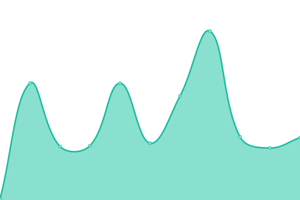
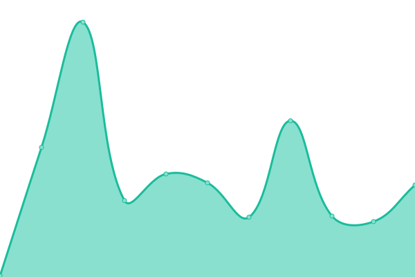
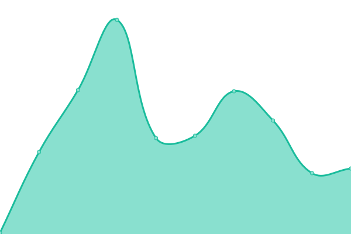

# [📈 Live Status](https://status.ichr.me): <!--live status--> **🟩 All systems operational**

This repository contains the open-source uptime monitor and status page for [ChrAlpha](https://chralpha.com), powered by [Upptime](https://github.com/upptime/upptime).

With [Upptime](https://upptime.js.org), you can get your own unlimited and free uptime monitor and status page, powered entirely by a GitHub repository. We use [Issues](https://github.com/ChrAlpha/upptimes/issues) as incident reports, [Actions](https://github.com/ChrAlpha/upptimes/actions) as uptime monitors, and [Pages](https://status.ichr.me) for the status page.

<!--start: status pages-->
<!-- This summary is generated by Upptime (https://github.com/upptime/upptime) -->
<!-- Do not edit this manually, your changes will be overwritten -->

| URL                                             | Status | History                                                                                                    | Response Time                                                                         | Uptime                                                                                                                                                                                                                    |
| ----------------------------------------------- | ------ | ---------------------------------------------------------------------------------------------------------- | ------------------------------------------------------------------------------------- | ------------------------------------------------------------------------------------------------------------------------------------------------------------------------------------------------------------------------- |
| [Blog](https://blog.ichr.me)                    | 🟩 Up  | [blog.yml](https://github.com/ChrAlpha/upptimes/commits/master/history/blog.yml)                           |  98ms              |                            |
| [Theme Cards Site](https://theme-cards.ichr.me) | 🟩 Up  | [theme-cards-site.yml](https://github.com/ChrAlpha/upptimes/commits/master/history/theme-cards-site.yml)   |  95ms  |    |
| [Personal Homepage](https://ichr.me)            | 🟩 Up  | [personal-homepage.yml](https://github.com/ChrAlpha/upptimes/commits/master/history/personal-homepage.yml) |  95ms |  |

<!--end: status pages-->

[**Visit our status website →**](https://status.ichr.me)

## 📄 License

- Code: [MIT](./LICENSE) © [ChrAlpha](https://chralpha.com)
- Data in the `./history` directory: [Open Database License](https://opendatacommons.org/licenses/odbl/1-0/)
